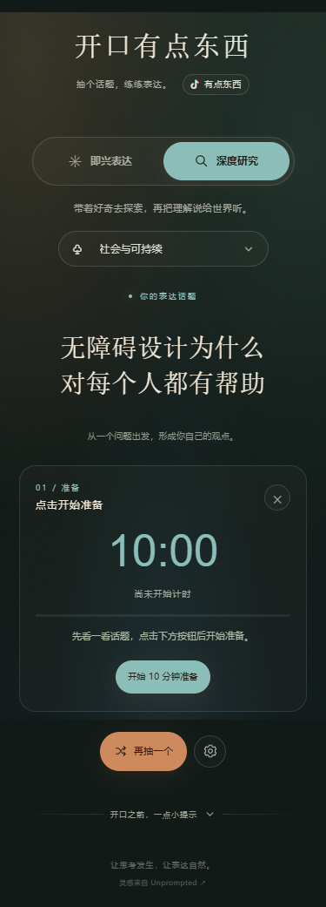

# 开口有点东西

一个中文即兴表达与深度研究练习网站。抽取话题后，先手动开始准备倒计时；准备结束后，再由使用者手动开始表达倒计时。

在线访问：[https://zmwt.online/](https://zmwt.online/)



## 功能

- 即兴表达：12 个分类，每类 40 题，共 480 题。
- 深度研究：6 个分类，每类 40 题，共 240 题。
- 题库共 720 题，包含“羊群效应”“囚徒困境”等概念词和可直接回答的短问题。
- 抽题动画、手机触摸音频唤醒与切换提示音。
- 默认准备 10 分钟、表达 1 分钟，均可在练习设置中修改。
- 准备与表达分两次手动开始，等待期间不消耗时间。
- 设置自动保存在当前浏览器中。
- 原生 HTML、CSS 和 JavaScript，无框架、无构建依赖、无后台服务。

## 本地运行

可以直接双击打开 `index.html`。也可以在项目目录运行一个静态服务器：

```bash
python -m http.server 4173
```

然后访问 `http://127.0.0.1:4173/`。

## 文件说明

- `index.html`：页面结构。
- `styles.css`：页面样式和手机布局。
- `topics.js`：全部分类与题库。
- `app.js`：抽题、音效、计时和设置逻辑。
- `standalone/开口有点东西.html`：可直接离线使用的单文件版本。
- `docs/部署说明.md`：静态服务器和 GitHub Pages 部署方法。

## 手机提示音

首次触摸“抽一个话题”时，网站会唤醒手机浏览器的音频功能。请在练习设置中开启提示音，并确认手机媒体音量、静音开关和蓝牙音频输出正常。

